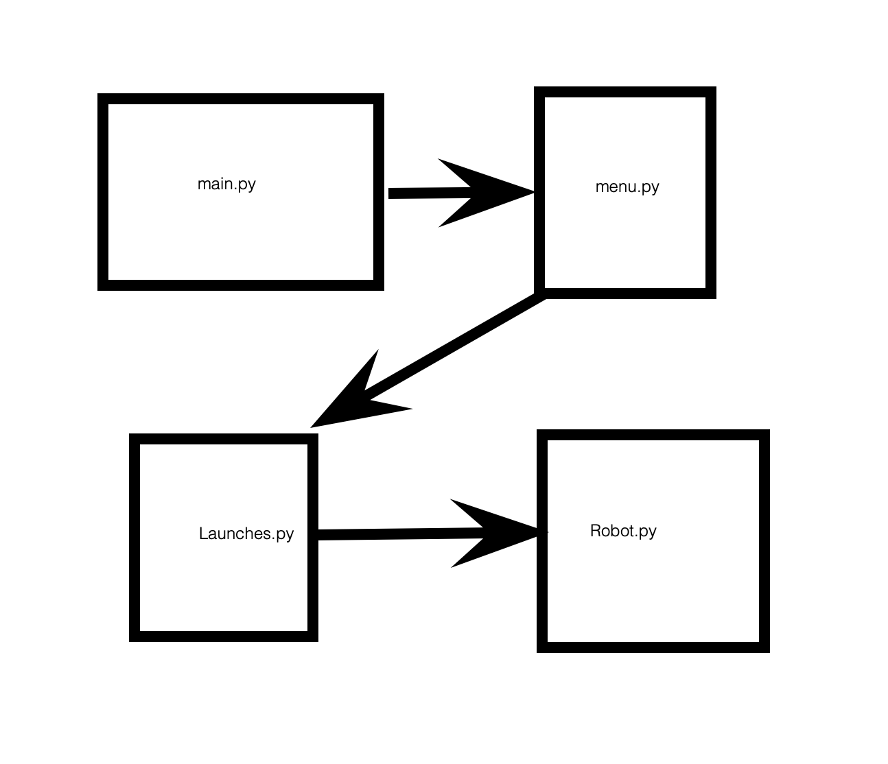

# EV3Python2020 - python code for EV3 robot

## Introduction

We are Radioactive Robotics, an FLL team from Pocahontas County, WV, USA, North America, Earth, Solar System, Milky Way, Universe.

This python code runs our EV3 robot in the FLL 2020-2021 robot game (Replay).

## How To Install and Run

Follow the instructions at

https://education.lego.com/en-us/product-resources/mindstorms-ev3/teacher-resources/python-for-ev3

We are using version 1.0 of EV3 MicroPython for running our EV3 robot with python.

## Our Robot

The sensors our robot have our light sensors and a gyro sensor.  But currently we are only using the gyro sensor.

We have two medium motors on the top and two large motor for the wheels.

If you want to know how the motors and sensors and connected to ports see Robot.py

Here's a picture of our robot from around August 2020:

## The Code

We organized our code through different files:

   * main.py: This is where the code starts.  You can change main.py to test the robot.  During competition, we run menu() here.
   * menu.py: This is where you can choose which launch to run.  It tells you on the screen which button to press for each launch.
   * launches.py: This is each individual launch that you run.  If it works properly, the robot should go and solve missions, and come back to base.  Each launch in launches.py is a function.
   * Robot.py: This holds our Robot class.  The Robot class lets us define everything that is part of our robot, like motors, sensors, wheel diameter, etc.  This class has functions for letting us do things like turn motors, driving straight and spinning acurately with the gyro sensor, etc.

Here are some lines and boxes to help visualize the code.  The lines show the heirarchy of the code where each box represents a file.

   

## Design Process

### Background

We wanted to try getting our robot to do all the same basic things it could do last season, but coded in Python, rather then the EV3 block language.

In January 2020, after our 2019-2020 season ended, we started learning python, and then started using the EV3 MicroPython version 1.0 with our EV3 robot.

After taking a break because of the Covid pandemic, we then continued virtually online in the summer of 2020.  By August, we had learned enough about how to use python with our robot to start this code repository.

### Process

Our process for developing this software is simple:

   * write or change the code to either fix a problem or create a new feature
   * comment it!
   * test it!
   * if it doesn't work, we repeat until it does!

### Tracking Changes

We use git and github to track the changes in our code.

Here's the process we usually use:

   * At the beginning of practice, get the latest code from github py 'pulling'
   * Once we have changes we want to keep, we:
      * Use the 'add' command for each file that changed
      * Then we use the 'commit' command and add a comment to save that change
   * At the end of practice, we 'push' the latest code back up to github   

If there are problems, we ask our coach!

## Innovations

### Proportional Programming

TBF: describe how we go straight with the gyro sensor

### Ramping the Speed

   

