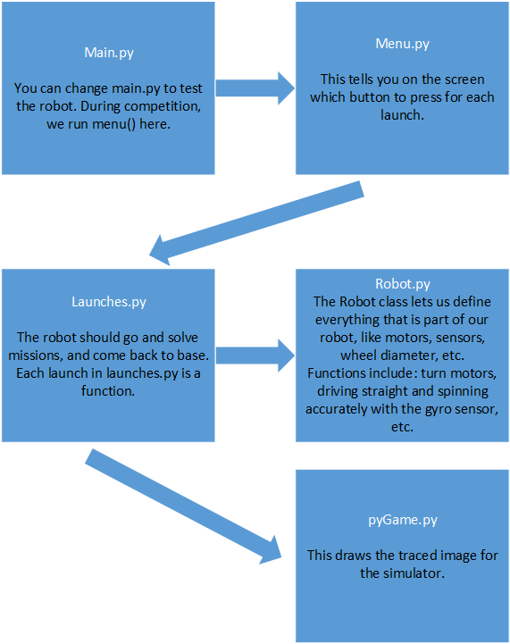
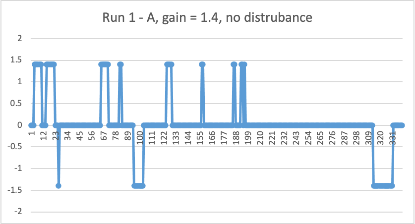
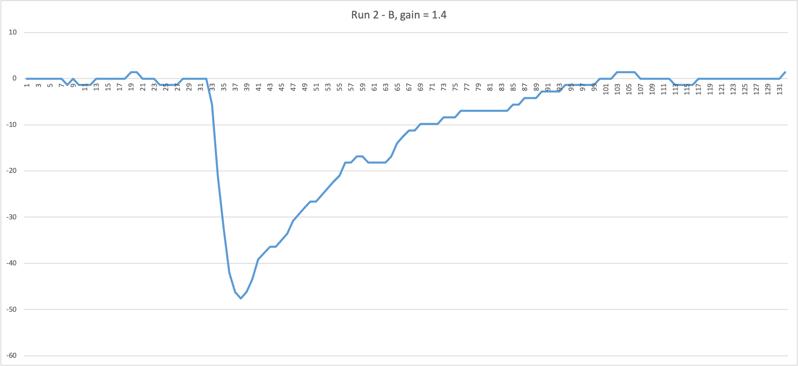
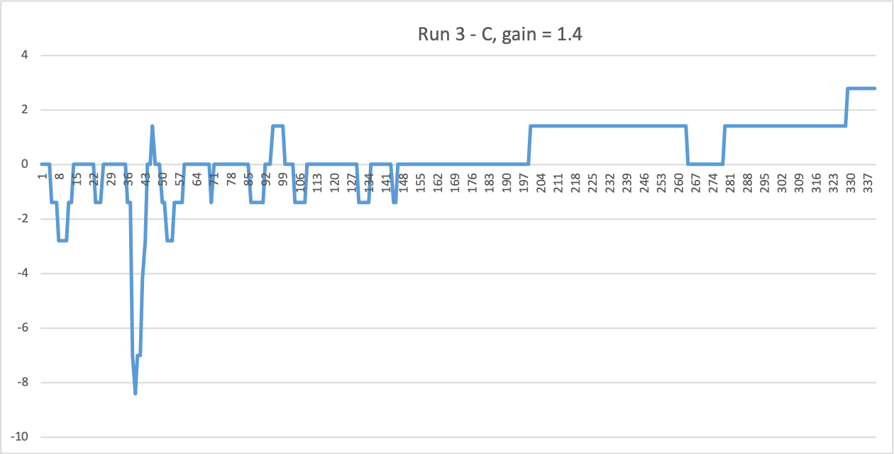
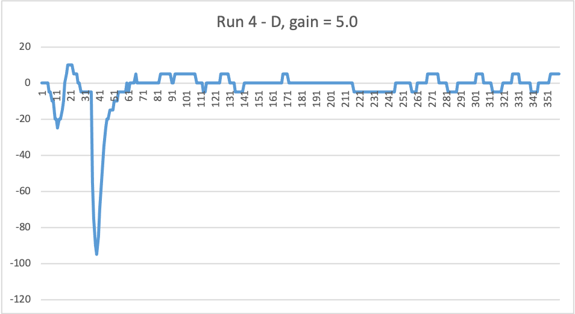
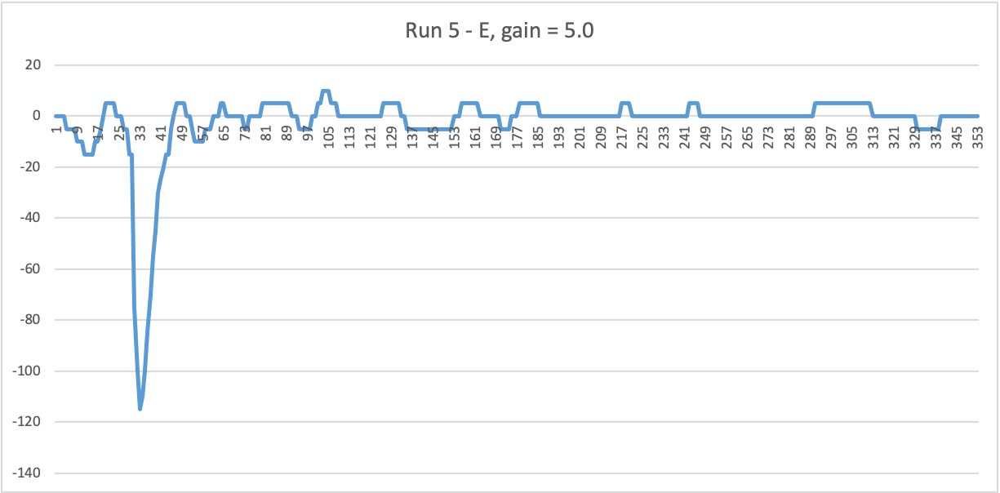
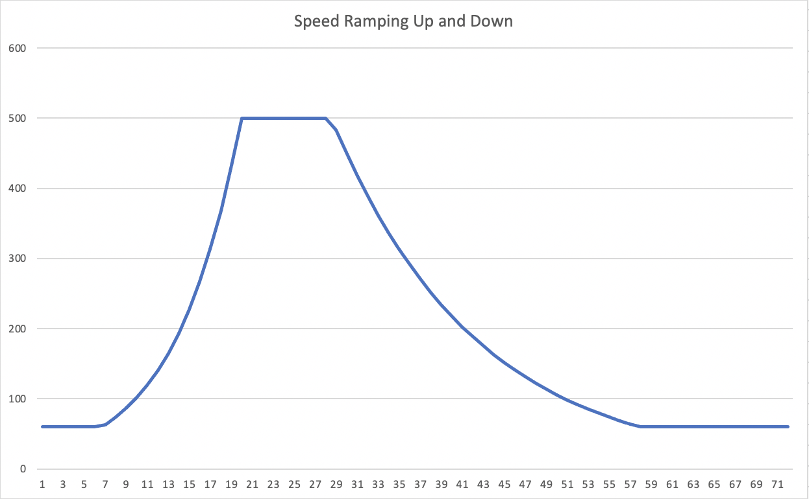
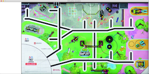

# EV3Python2020 - python code for EV3 robot

## Introduction

We are Radioactive Robotics, an FLL team from Pocahontas County, WV, USA, North America, Earth, Solar System, Milky Way, Universe.

This python code runs our EV3 robot in the FLL 2020-2021 robot game (Replay).

## How To Install and Run

Follow the instructions at

https://education.lego.com/en-us/product-resources/mindstorms-ev3/teacher-resources/python-for-ev3

We are using version 1.0 of EV3 MicroPython for running our EV3 robot with python.

Or you can run this code on your computer, and it will draw a picture of where the robot would go.  For more information, see the Simulations section below.

To run this code on your robot, in the terminal, you will need the pygame package (we use a virtual enviornment for this).  Change the launch function called at the bottom of launches.py.  Then:

   * cd EV3Python2020
   * python3 launches.py

## Our Robot

The sensors our robot have our light sensors and a gyro sensor.  But currently we are only using the gyro sensor.

We have two medium motors on the top and two large motor for the wheels.

If you want to know how the motors and sensors and connected to ports see Robot.py

Here's a picture of our robot from around August 2020:

## The Code

We organized our code through different files:

   * main.py: This is where the code starts.  You can change main.py to test the robot.  During competition, we run menu() here.
   * menu.py: This is where you can choose which launch to run.  It tells you on the screen which button to press for each launch.
   * launches.py: This is each individual launch that you run.  If it works properly, the robot should go and solve missions, and come back to base.  Each launch in launches.py is a function.
   * Robot.py: This holds our Robot class.  The Robot class lets us define everything that is part of our robot, like motors, sensors, wheel diameter, etc.  This class has functions for letting us do things like turn motors, driving straight and spinning acurately with the gyro sensor, etc.

Here are some lines and boxes to help visualize the code.  The lines show the heirarchy of the code where each box represents a file.

   

## Design Process

### Background

We wanted to try getting our robot to do all the same basic things it could do last season, but coded in Python, rather then the EV3 block language.

In January 2020, after our 2019-2020 season ended, we started learning python, and then started using the EV3 MicroPython version 1.0 with our EV3 robot.

After taking a break because of the Covid pandemic, we then continued virtually online in the summer of 2020.  By August, we had learned enough about how to use python with our robot to start this code repository.

### Process

Our process for developing this software is simple:

   * write or change the code to either fix a problem or create a new feature
   * comment it!
   * test it!
   * if it doesn't work, we repeat until it does!

### Tracking Changes

We use git and github to track the changes in our code.

Here's the process we usually use:

   * At the beginning of practice, get the latest code from github py 'pulling'
   * Once we have changes we want to keep, we:
      * Use the 'add' command for each file that changed
      * Then we use the 'commit' command and add a comment to save that change
   * At the end of practice, we 'push' the latest code back up to github   

If there are problems, we ask our coach!

## Innovations

### Proportional Programming for Driving Straight

LEGO robots are plastic toys.  The two wheels might not turn at the same speed, causing the robot to turn instead of going straight, even if you give them the same exact power.  When the robot is built, there could be some mechanical issues as well.

Our solution is to use the Gyro sensor.  If the robot is going straight, the Gyro sensor should be giving a constant value.  If we see that the Gyro sensor values are changing, we use those values to steer the robot back into a straight line.

To do this, we use part of the PID method.  PID stands for Proportional, Integrated, Derivative.  The team explored PID two years ago, but this year we just are using Proportional programming.

In Proportional programming, you have a target value that you want your sensor, to keep reading.  Any values from the sensor that are different, we call an error.  We then use that error to make corrections to the system, so that error will go back to zero.

With our robot, our target value is whatever the Gyro sensor reads when it starts to go straight.  The error is the distance from the target angle.  If the robot is set to go at a target angle of zero, but then becomes five, the error would be five.  We multiply the error by the 'gain' (a number that we figured out by testing) to find the correction.  The correction is applied to the motor.  If the error was five, and the 'gain' was two, the correction would be 2*5=10, and this would be applied to the motors to fix the turning problem.

It's called Proportional Programming because our corrections are proportional to the error.  

#### Experiments with Gain Values

These graphs show our different tests to see how accurate our Gyro sensor and proportional code worked.  For each graph, the y axis is the correction and the x axis is (sort of) time.  We created these graphs by having the robot go straight with our proportional code while printing the corrections.  We then cut and paste these numbers into an excel spreadsheet and made simple graphs.

*Run 1* - robot goes pretty straight when not disturbed!  Gyro sensor angles never go past 1 or -1, and most of the time it's at zero!  Here the gain is 1.4.

*Run 2* - Our robot got disturbed at row number 32, and got pushed all the way to an angle of -47/1.4 = -33.  Wow.  But it eventually straightens out by row number 100, and has only a small overshoot.  We hit the robot at 32, and got zero by 95, that's 95 - 32 = 63 row numbers.  The gain is still 1.4.

*Run 3* was invalid because we didn't hit the robot hard enough!

*Run 4*  - At row number 40, we hit the robot to -90/1.4 = -67 degrees!  Twice as hard as Run 2!
With a gain of 5.0, we go from -67 to 0 degrees in about 20.  conclusion: the larger gain means we recover from the disturbance much faster.  Hardly any overshoot!  after the disturbanc remains pretty straight.

*Run 5* is much like Run 4.

In conclusion, a higher gain is better because it corrects faster.  But using too high a gain might constantly over correct and be stuck in a loop.  Proffesionals call this oscillation, and it should be avoided.  We have yet to find an ideal gain because we have not tested enough.

### Ramping the Speed

The robot jerks when it sarts and stops. This causes navagational errors. We fixed this by rampping the speed. You can look at the graphs below to see the speed values in driveStraightCms.

   This last graph was made with a sinulator! (See below) 

These curves should be straight if we were graphing time, but we are graphing number of readings. We get more printouts at lower speeds than higher speeds.

### Simulations - Running the code without the robot

What is the simulator? The simulator is part of the code that fakes classes on the robot so it can be run on the computer. The simulator also draws a picture of the a trace of the robot's path on an accurate scale modle of the board.

This idea was given to us from the Software Engineers at the Green Bank Observatory.
The motavation was that we could test things without running things on the bot.

The first time we ran the robot code on the computer, we got an import error because it didn’t have the EV3 library. The coach thought that putting the EV3 library on the computer would cause more problems then it would solve. We got past the import errors by faking the imports.  We use try/except bocks for our imports of the EV3 library. If there is an excpetion it means we are on the computer, and can't import the EV3 library. This is where we fake the classes we need from the EV3 library.

By faking, we mean we create new classes with the same names and the same functions as the ones from the EV3 library, but the classes are a lot simpler. Currently we have faked two classes, the Motor class and Gyro sensor class.  We are also faking constants like the ports.

We give our robot a memory so that it knows where it is and has been and then uses that information to draw a line of it's path on an accurate scaled picture of the board! We use the pygame library to draw the picture of the board and where the robot's been on the screen. 

Below is a picture of the pullUpBar launch, simulate (run on the computer). The same code that completes this mission on the board is the same code that drew this picture!  The robot is hard to see, but it starts in the launch, moves to below the pullup bar, turns, and goes below pullup bar.  We plan on making these lines bigger in the future.

We also used this simulator to also ramp up the speed in Robot.driveStraightCms. This is a good example of developing and testing code without using the robot!
