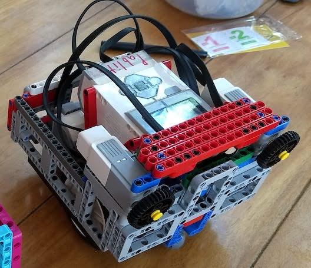
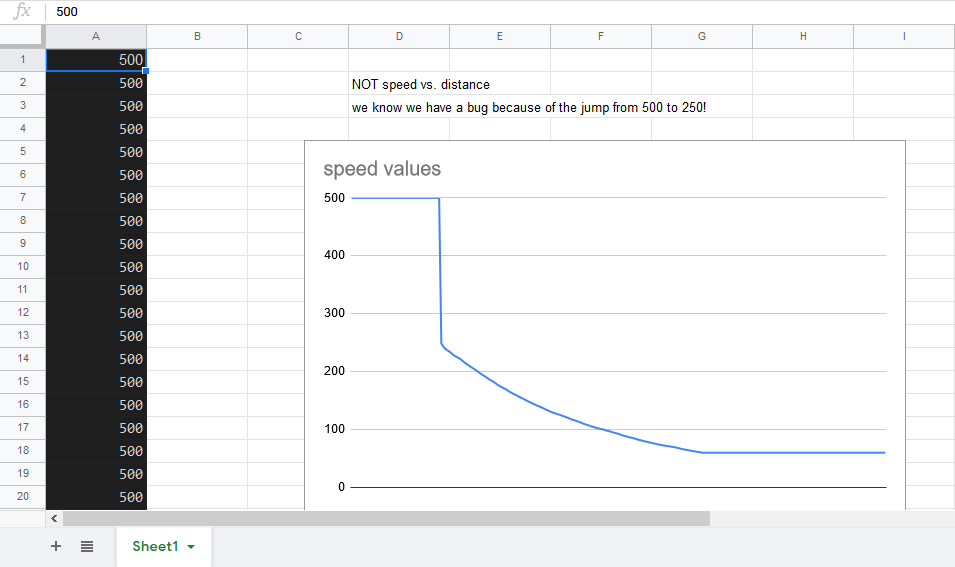
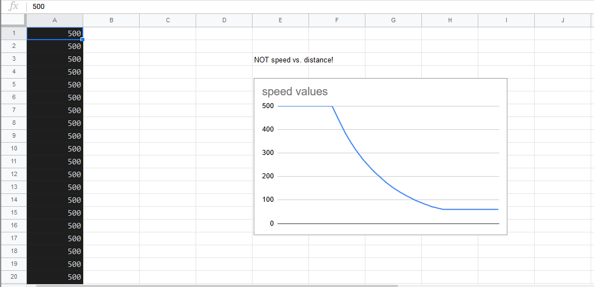

# EV3Python2020 - python code for EV3 robot

## Introduction

We are Radioactive Robotics, an FLL team from Pocahontas County, WV, USA, North America, Earth, Solar System, Milky Way, Universe.

This python code runs our EV3 robot in the FLL 2020-2021 robot game (Replay).

## Our Robot

TBF: What should we say about the robot that's important to the code?

TBF: we removed these images because they are too big, and take time to
get copied to the robot.

## The Code

TBF: Explain how this code is organized

## Design Process

### Background

We wanted to try getting our robot to do all the same basic things it could do last season, but coded in Python, rather then the EV3 block language.

In January 2020, after our 2019-2020 season ended, we started learning python, and then started using the EV3 MicroPython version 1.0 with our EV3 robot.

After taking a break because of the Covid pandemic, we then continued virtually online in the summer of 2020.  By August, we had learned enough about how to use python with our robot to start this code repository.

### Process

TBF: what was our process?

### Innovations

#### Ramping the Speed

   

